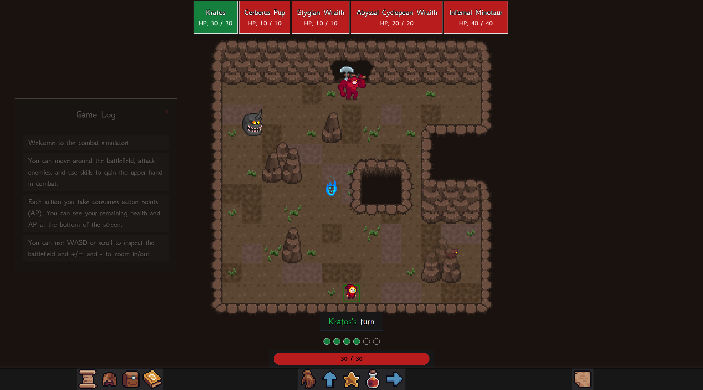

# Return to Olympus

## Combat Simulator

Combat simulator for Return to Olympus



- [x] Turn-based system
- [x] Action Point system
- [x] Basic attack
- [x] Enemy receive damage & defeat
- [x] Logging
- [x] Inventory
- [x] Player movement
- [x] Player skills
  - [x] Flex
  - [x] Ironflesh
  - [x] Gorgon's Gaze
  - [x] Lightning
  - [x] Fly
  - [x] Whirlwind
  - [x] Fireball
  - [x] Freeze
  - [x] Absorb
  - [x] Execute
  - [x] Cleave
  - [x] Annihilate
  - [x] Warcry
  - [x] Bloodlust
  - [x] Focus
  - [x] Enlighten
  - [x] Weaken
  - [x] Disable
  - [x] Entangle
  - [x] Leap Slam
  - [x] Flame Dive
  - [x] Hide
  - [x] Shadow Strike
  - [x] Swift Movement
  - [x] Throwing Knives
  - [x] Instinctual Dodge
  - [ ] Bloodletting
  - [x] Poison Strike
  - [ ] Disabling Blow
  - [ ] Puncture Strike
- [x] Enemy attack (naive)
- [x] Enemy movement (naive)
- [x] Sprites for each of the above
- [x] Animations for each of the above (except player attacks)
- [ ] Multiple rooms (floor)
- [x] Room generator

## Setup

1. Clone the repository:

   ```bash
   git clone https://github.com/codetrifecta/rto-combat-simulator
   cd rto-combat-simulator
   ```

2. Install dependencies:

   ```bash
   npm install
   ```

3. Run the server:
   ```bash
   npm run dev
   ```
